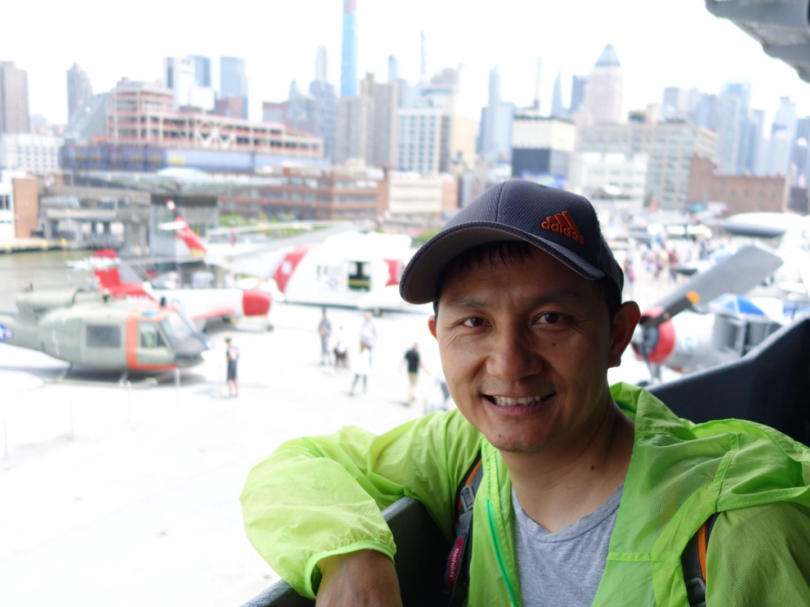

**Background**  
Wei received his BSc and M.S. from Central China Normal Univeristy. Before joined The Rockefeller Univeristy, He has been worked at Chinese Academy of Sciences, University of Toronto, The Hospital for sick children.

In 2020, Wei joined the Bioinformatics Resource Center. He continues to the development of the Rfastp R Bioconductor package.  As a member of the core, the types of data he works on include bulk and single cell RNA sequencing, whole genome sequencing, population genetics. Additionally, he is particularly interested in
troubleshooting for all kinds of sequencing issues, NGS analysis issues, analysis environmental issues and system issues. 

**Team Roles**: Bioinformatics analyst performing next generation sequencing analysis and leads the development of database design, mantainance and API development.

